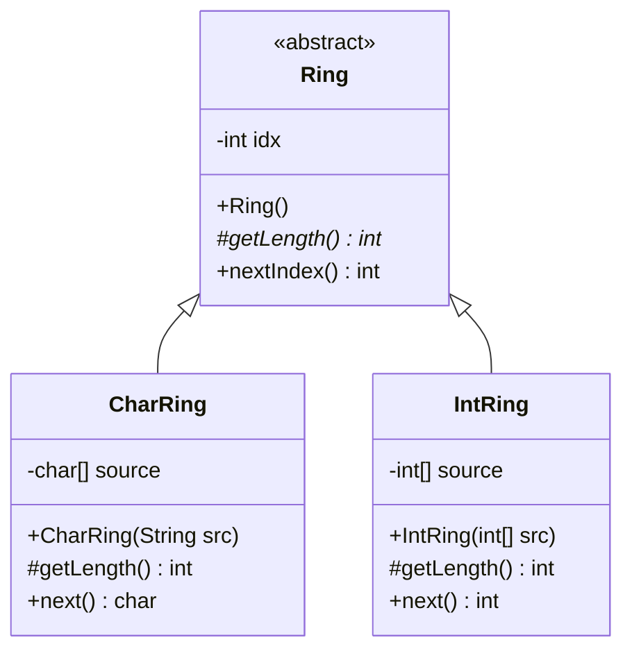

<!-- markdownlint-disable -->
# Ejercicio 3

## Tareas
Se cuenta con las siguientes implementaciones de iteradores circulares, las cuales presentan implementaciones similares. 
1) Diseñe e implemente Test de Unidad para las clases CharRing e IntRing. Asegúrese de que los test pasen.
2) Aplique el refactoring Extract Superclass. Detalle cada uno de los pasos intermedios que son necesarios para poder aplicar correctamente este refactoring.
3) Verifique que los tests definidos en el paso 1 sigan funcionando correctamente.
4) Realice un diagrama de clases UML con el diseño refactoriz

### CharRing.java
```java
public class CharRing {
    private char [] source;
    private int idx;

    public CharRing(String src){
        source = src.toCharArray();
        idx=0;
    }

    public char next(){
        if(idx >= source.length)
            idx=0;
        return source[idx++];
    }
}

```
### IntRing.java
```java
public class IntRing {
    private int [] source;
    private int dx;

    public IntRing(int[] src){
        source = src;
        idx=0;
    }

    public int next(){
        if(idx >= source.length)
            idx=0;
        return source[idx++];
    }
}

```

### Tarea 1: Realizar Test
¿Qué hace la clase? Una sola cosa: dado un arreglo, devolver elementos en orden circular. Entonces todos los tests giran en torno a `next()`.

```java
//CharRingTest.java
public class IntRingTest {
	
	IntRing ring1, ring2;
	
	@BeforeEach
	void setUp() throws Exception{
		ring1 = new IntRing(new int[]{1, 2, 3});
		ring2 = new IntRing(new int[]{1});
	}
	
	@Test
    public void testNextReturnsPrimerosPrimeroElemento() {
        assertEquals(1, ring1.next());
    }
	
	@Test
    public void testNextVuelveAlInicioAlSuperar() {
        ring1.next(); // '1'
        ring1.next(); // '2'
        ring1.next(); // '3'
        assertEquals(1, ring1.next()); 
    }
    
    @Test
    public void testNextConUnSoloElemento() {
        assertEquals(1, ring2.next());
        assertEquals(1, ring2.next());
        assertEquals(1, ring2.next());
    }
}
```

```java
//CharRingTest.java
public class CharRingTest {
	
	CharRing ring1, ring2, ring3;
	
	
	@BeforeEach
	void setUp() throws Exception {
		ring1 = new CharRing("abc");
		ring2 = new CharRing("x");
	}
	
    @Test
    public void testNextReturnsPrimerosPrimeroElemento() {
        assertEquals('a', ring1.next());
    }
    
    @Test
    public void testNextVuelveAlInicioAlSuperar() {
        ring1.next(); // 'a'
        ring1.next(); // 'b'
        ring1.next(); // 'c'
        assertEquals('a', ring1.next()); 
    }
    
    @Test
    public void testNextConUnSoloElemento() {
        assertEquals('x', ring2.next());
        assertEquals('x', ring2.next());
        assertEquals('x', ring2.next());
    }
}
```

### Tarea 2: Realizar el refactoring Extract Superclass
### Paso 0 — Identificar código duplicado
Ambas clases tienen en común:

Campo `idx` de tipo `int`
    
Lógica del ciclo: resetear `idx` cuando supera la longitud y retornar `source[idx++]`

La diferencia es solo el tipo del arreglo (`char[]` vs `int[]`)

### Paso 1 - Crear la superclase abstracta `Ring`
Se extrae el campo `idx`y buscar una manera de calcular el tamaño del arreglo porque ya no esta la variable `source`

### Ring.java
```java
public abstract class Ring {
    private int idx;

    public Ring(){
        idx=0;
    }

    protected abstract int getLength();


    public int nextIndex(){
        if(idx >= getLength())
            idx=0;
        return idx++;
    }
}
```
### Paso 2 - Refactorizar CharRing para extender `Ring`
### CharRing.java
```java
public class CharRing extends Ring {
    private char source []

    public CharRing(String src){
        super();
        source = src.toCharArray();
    }

    protected int getLength(){
        return source.length;
    }

    public char next(){
        return source[nextIndex()];
    }
}
```

### Paso 3 — Refactorizar IntRing para extender Ring
### IntRing.java
```java
public class IntRing extends Ring {
    private int[] source;

    public IntRing(int[] src) {
        super();
        source = src;
    }

    @Override
    protected int getLength() {
        return source.length;
    }

    public int next() {
        return source[nextIndex()];
    }
}
```

### Tarea 3: verificacion de test en Eclipse

### Tarea 4: UML

